# Helply System Architecture Documentation

This document describes the high-level system architecture, component relationships, data boundaries, and technical blueprints for the **Helply - Student AI Operating System**.

---

## 1. System Architecture

Helply is structured around a **Local-First, Edge AI Driven Architecture** where the mobile application acts as the primary command center. The system minimizes cloud dependencies, keeping all personal academic data on the user's device while offering optional cloud integrations for synchronization, repository creation, and web portfolio deployment.

```mermaid
graph TD
    subgraph Mobile Device (Primary Command Center)
        UI[Jetpack Compose UI & ViewModels]
        AgentRuntime[Agentic State Engine]
        LiteRTEngine[LiteRT-LM Engine: Gemma 4 E4B]
        ToolReg[Kotlin Safety Tool Registry]
        LocalStore[(Room DB + SQLCipher + SQLite-VSS)]
    end

    subgraph Desktop / Laptop (Office Kit Bridge)
        OfficeBridge[Desktop Bridge Node]
        HeavyCompute[PPT / PDF / Heavy Research Engine]
    end

    subgraph Cloud / External Services
        GmailAPI[Gmail / Outlook OAuth API]
        CalendarAPI[Google / Device Calendar API]
        GitHubAPI[GitHub REST API & Actions]
        GHPages[GitHub Pages Hosting]
    end

    UI <--> AgentRuntime
    AgentRuntime <--> LiteRTEngine
    AgentRuntime <--> ToolReg
    ToolReg <--> LocalStore
    Mobile Device <== LAN WebSockets ==> OfficeBridge
    OfficeBridge <--> HeavyCompute

    ToolReg <== TLS 1.3 ==> GmailAPI
    ToolReg <== TLS 1.3 ==> CalendarAPI
    ToolReg <== TLS 1.3 ==> GitHubAPI
    GitHubAPI --> GHPages
```

---

## 2. Mobile Architecture

Built using Android **Clean Architecture** patterns combined with Unidirectional Data Flow (UDF) via ViewModels, StateFlow, and Jetpack Compose.

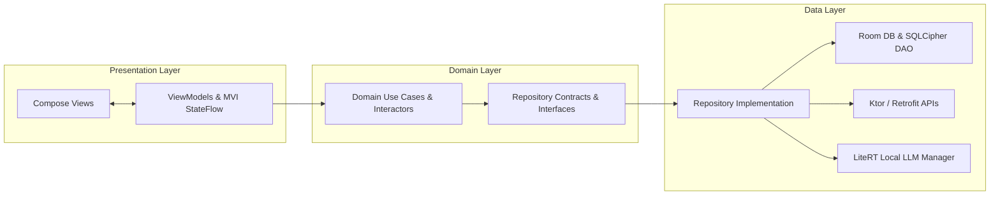

---

## 3. AI Architecture

Helply isolates LLM execution into an event-driven **Brain & Controller Pattern**:
- **Brain**: Gemma 4 E4B quantized model performing token reasoning and emitting tool-call JSON proposals.
- **Controller**: Kotlin Agent Engine validating input/output schemas, enforcing permissions, and executing domain tools.

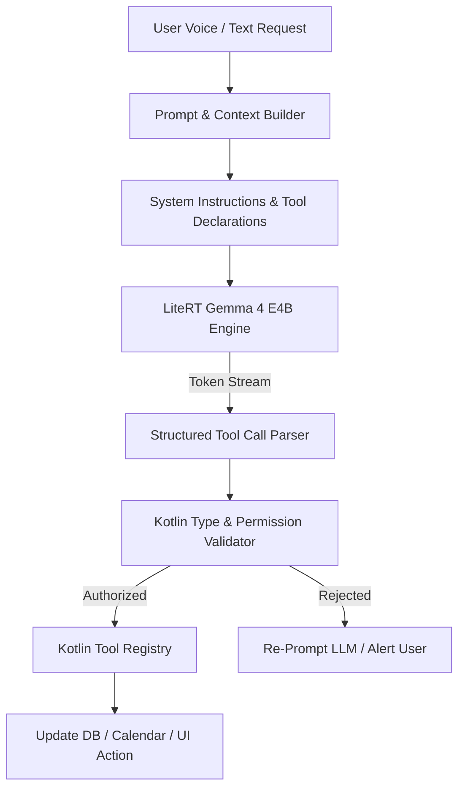

---

## 4. Edge Inference Architecture

To optimize thermal efficiency and battery consumption, Gemma 4 E4B is loaded on-demand and executed using hardware acceleration delegates.

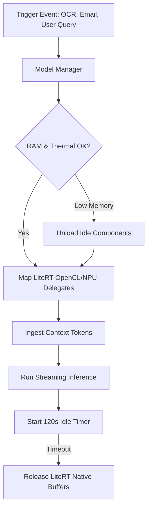

---

## 5. Agent Architecture

Each domain agent acts as an autonomous state machine handling intent classification, tool invocation, and multi-step execution.

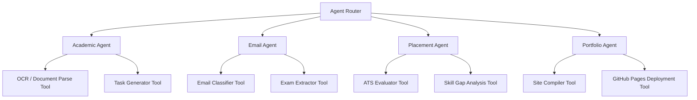

---

## 6. Memory Architecture

Personal Academic Memory combines structured entity persistence with semantic vector indexing for hybrid retrieval.

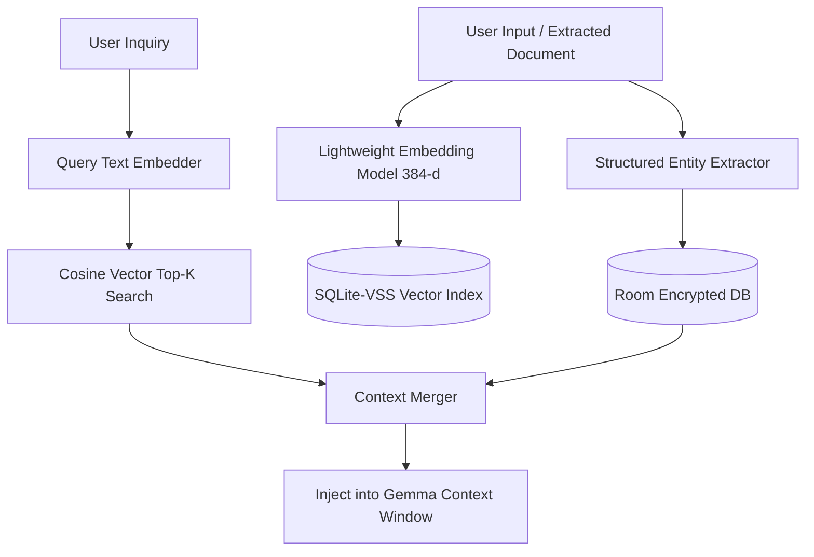

---

## 7. Database Architecture

The Room database (`helply_database.db`) uses strict foreign keys, index optimization, and SQLCipher AES-256 encryption.

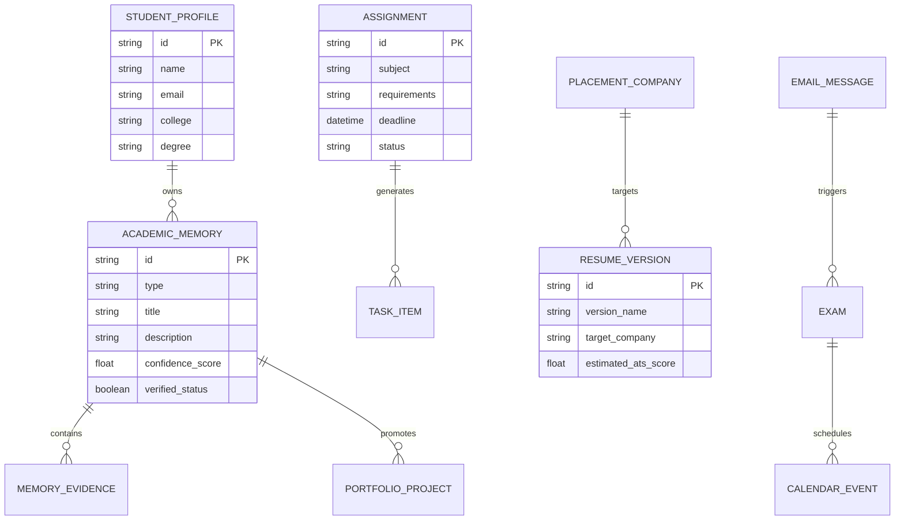

---

## 8. Email Architecture

Gmail / Outlook communication processing relies on OAuth 2.0 PKCE with local heuristic filters before invocation of Gemma classifier logic.

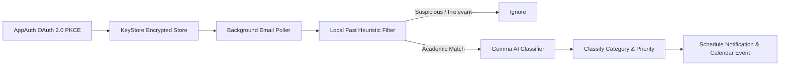

---

## 9. Calendar Architecture

Integrates bi-directionally with Android native `CalendarContract` and cloud providers.

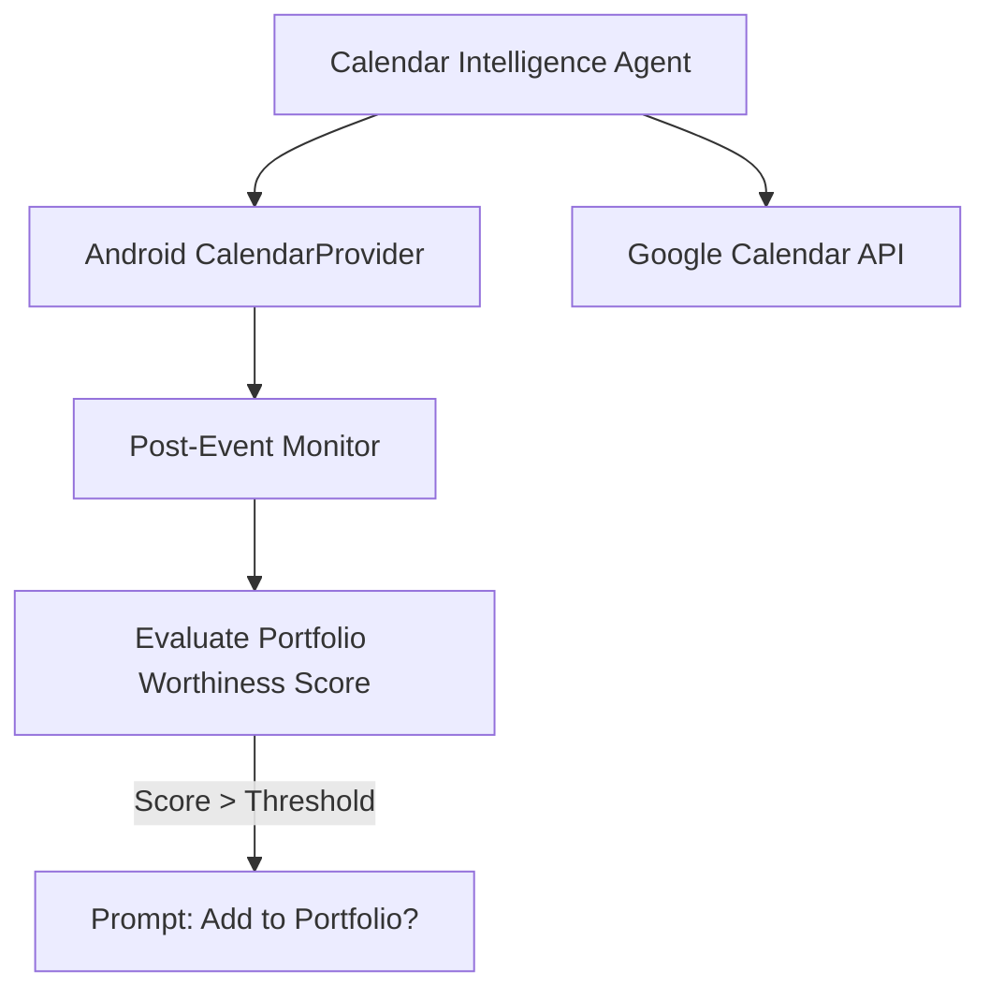

---

## 10. GitHub Architecture

Uses minimum scope OAuth (`repo`, `user`) to verify developer activity, code statistics, and orchestrate web portfolio deployments.

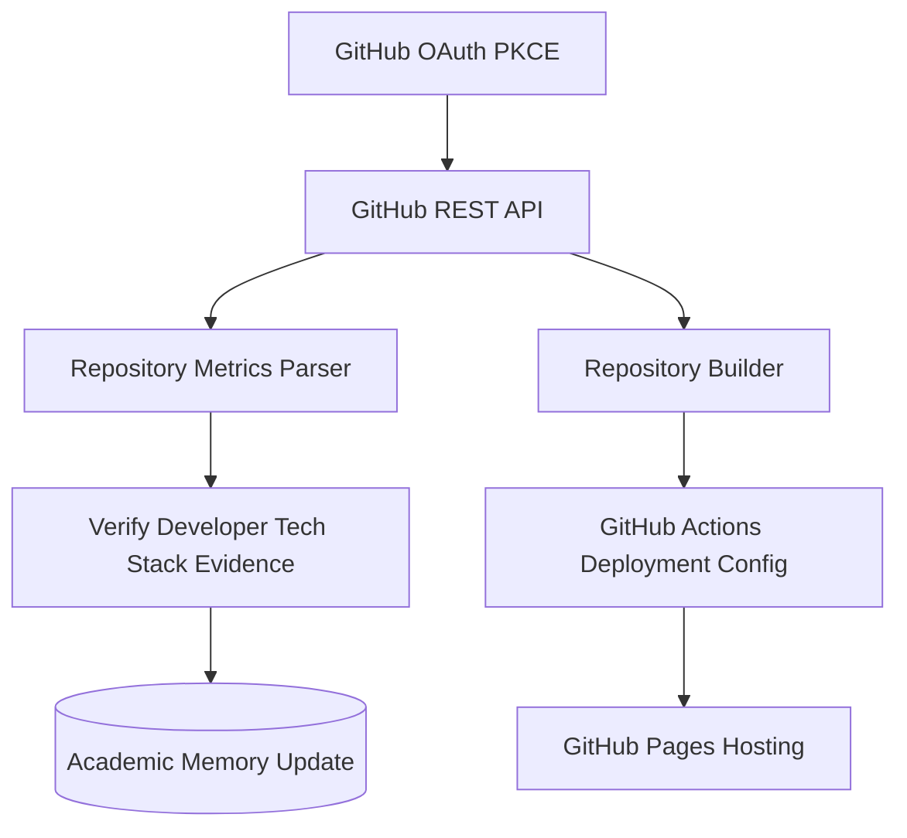

---

## 11. Resume Architecture

Parses PDF and DOCX files into structured internal data schemas and evaluates job description alignment.

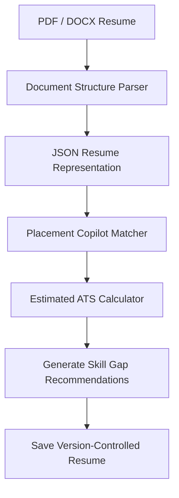

---

## 12. Portfolio Architecture

Compiles structured academic memories into production-ready responsive static websites supporting 8 visual themes.

```mermaid
graph TD
    Memories[(Verified Academic Memories)] --> DataBinder[Portfolio JSON Data Binder]
    DataBinder --> SelectedTheme[Theme Compiler (e.g. Modern Developer)]
    SelectedTheme --> StaticBundle[Generate HTML5 / Vanilla CSS / JS]
    StaticBundle --> Previewer[In-App WebView Dynamic Preview]
    Previewer -- User Approved --> Deployment[GitHub Pages Deploy Engine]
```

---

## 13. Office Kit Architecture

Pairs mobile device with local desktop node via mDNS and encrypted WebSockets on local WiFi.

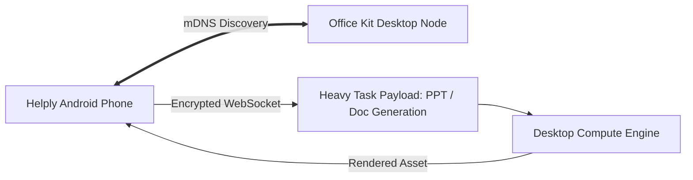

---

## 14. Security Architecture

Enforces defense-in-depth security across authentication, storage, and AI tool execution.

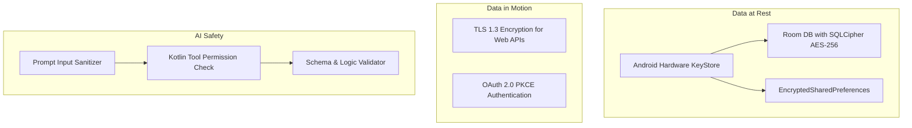

---

## 15. Data Flow

End-to-end data trajectory from document ingestion to portfolio publication:

```
[Assignment / Email / GitHub]
            │
            ▼
   [Local Parsing & OCR]
            │
            ▼
 [Gemma AI Context Analysis]
            │
            ▼
[Personal Academic Memory (Room)]
            │
            ▼
 [Placement & Resume Alignment]
            │
            ▼
 [Dynamic Portfolio Compilation]
            │
            ▼
  [GitHub Pages Deployment]
```

---

## 16. Network Boundaries

- **Strict Offline Boundary**: All memory operations, local assignment parsing, resume analysis, and Gemma inference run without external network traffic.
- **Controlled Network Calls**: Network communication occurs exclusively when initiating OAuth authentication, fetching email headers, reading GitHub repos, or triggering GitHub Pages deployment over HTTPS.

---

## 17. Offline Architecture

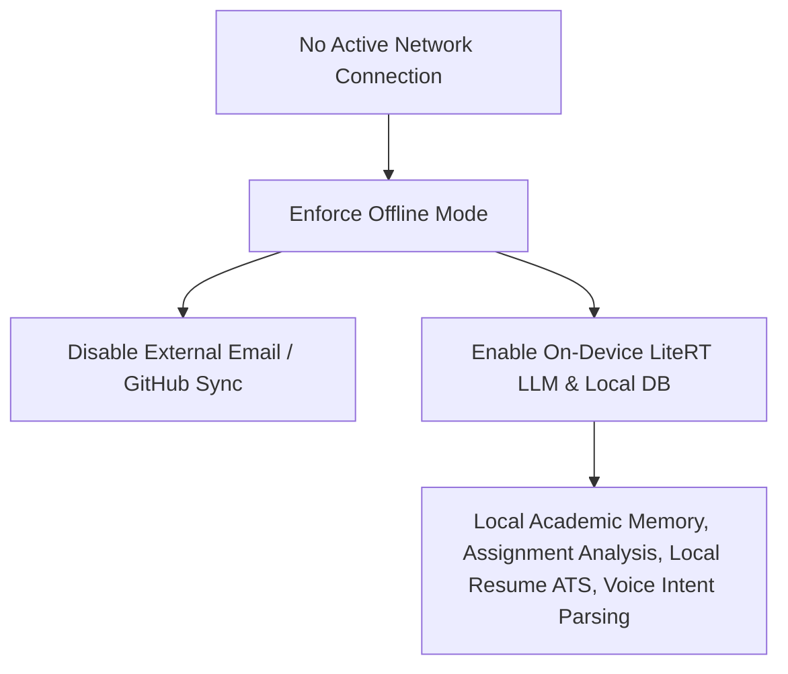

---

## 18. Deployment Architecture

```mermaid
graph TD
    AppBuild[Helply Gradle Build] --> Proguard[R8 ProGuard Code Obfuscation]
    Proguard --> SignedAPK[Signed Release APK / App Bundle]
    SignedAPK --> TargetDevice[Android ARM64 Devices (Android 9.0+)]
```
