# Helply Workflows Documentation

This document outlines the detailed end-to-end workflows for all primary operations supported by the **Helply - Student AI Operating System**.

---

## 1. First Launch Workflow

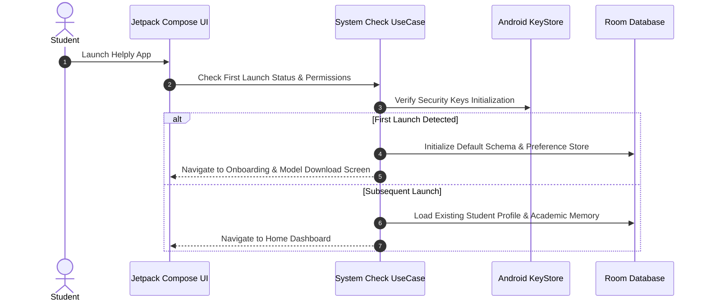

---

## 2. AI Model Installation Workflow

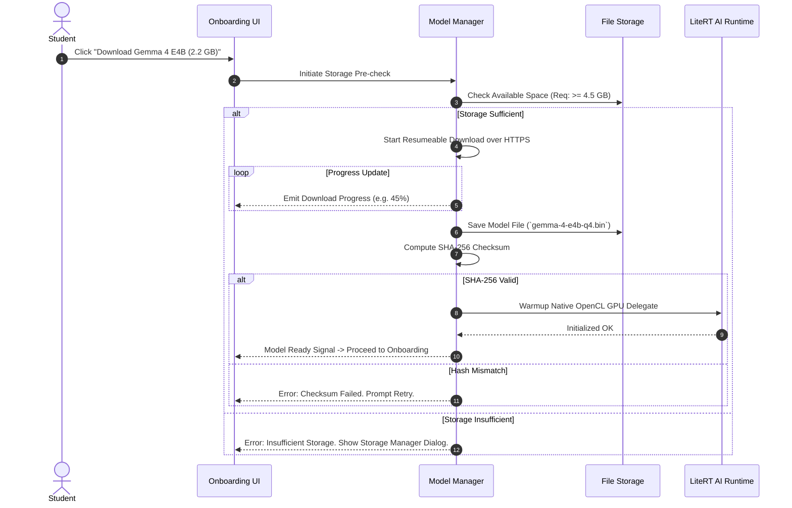

---

## 3. Student Onboarding Workflow

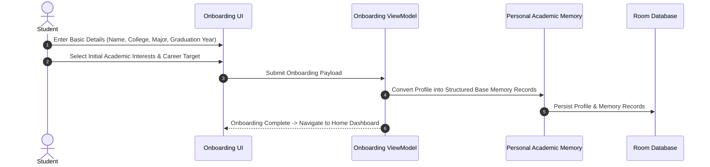

---

## 4. Memory Creation Workflow

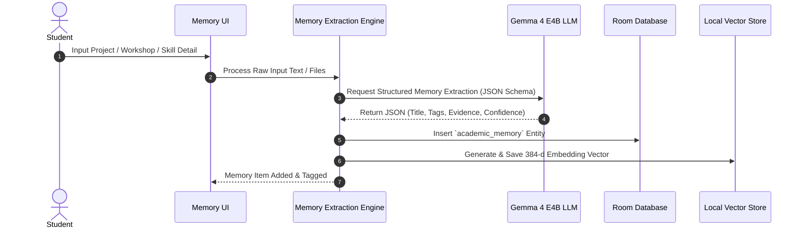

---

## 5. Assignment Workflow

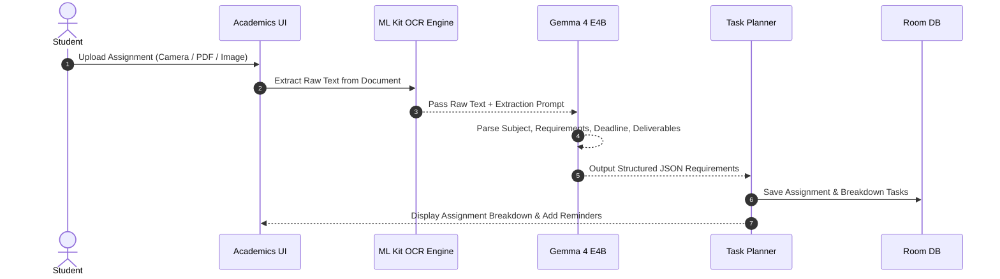

---

## 6. Research Workflow

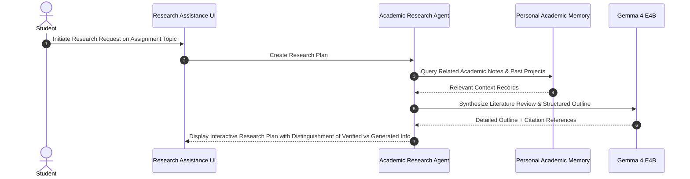

---

## 7. PPT Generation Workflow

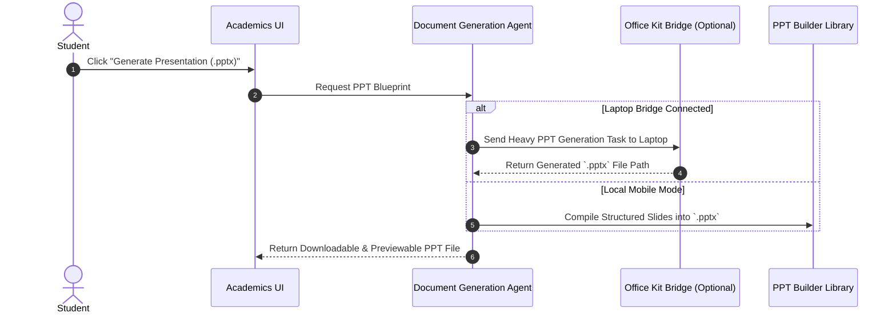

---

## 8. PDF Generation Workflow

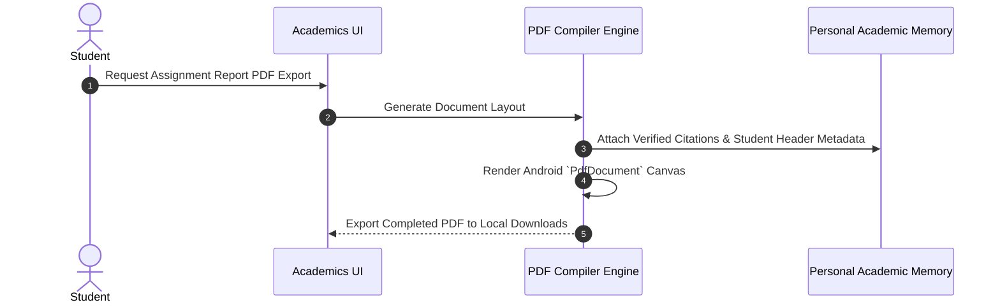

---

## 9. Email Ingestion Workflow

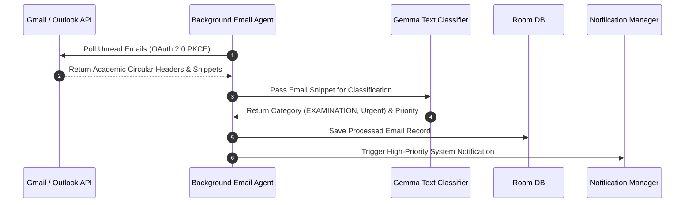

---

## 10. Exam Detection Workflow

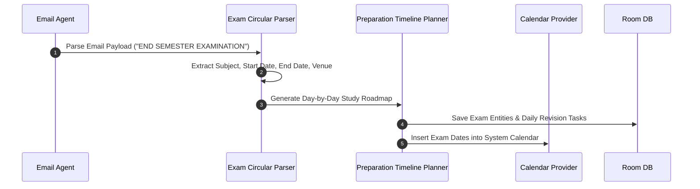

---

## 11. Notification Workflow

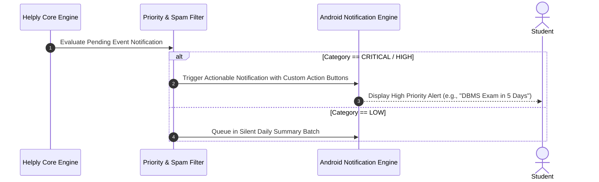

---

## 12. Focus Mode Workflow

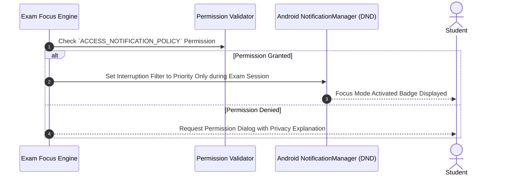

---

## 13. Placement Workflow

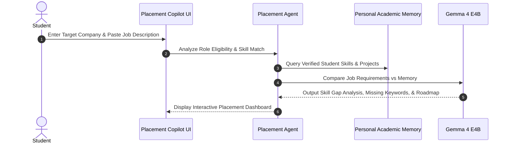

---

## 14. Resume Analysis Workflow

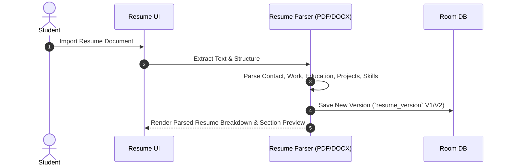

---

## 15. ATS Workflow

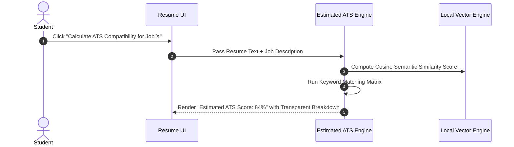

---

## 16. GitHub OAuth Workflow

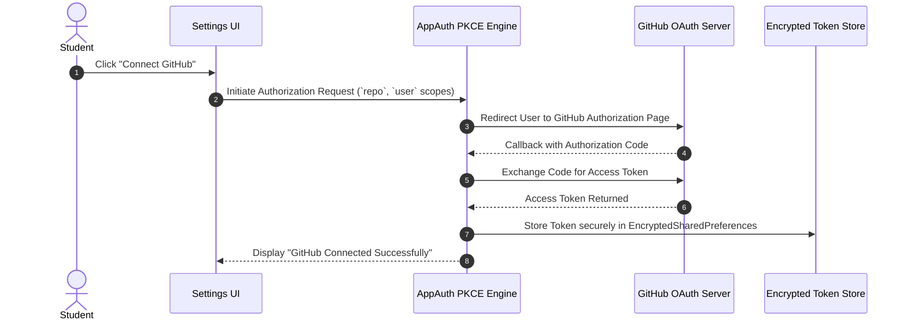

---

## 17. GitHub Analysis Workflow

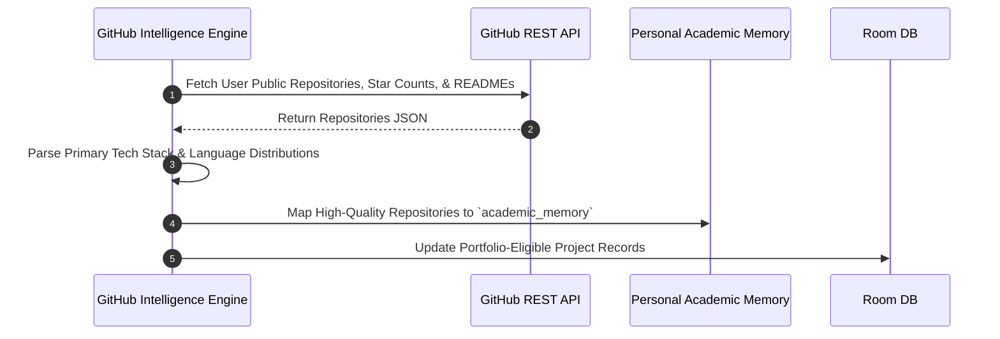

---

## 18. Portfolio Generation Workflow

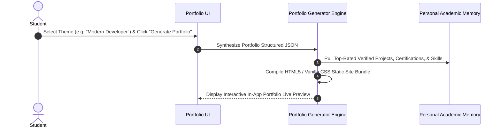

---

## 19. Calendar Event Detection Workflow

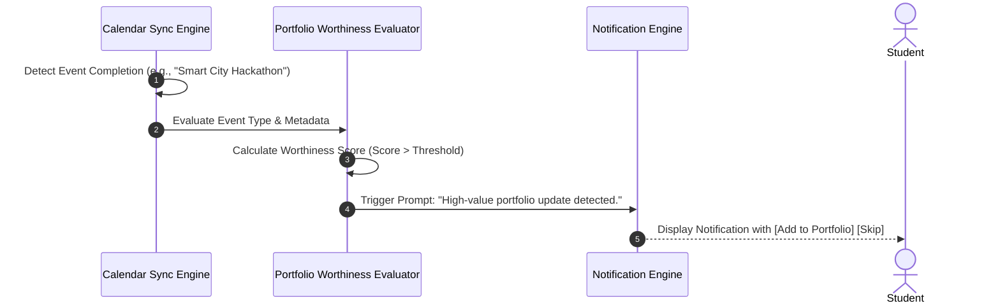

---

## 20. Portfolio Update Workflow

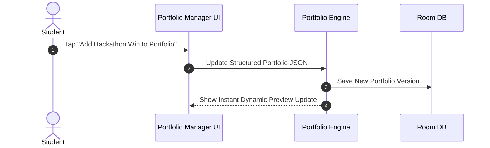

---

## 21. Image Upload Workflow

```mermaid
sequenceDiagram
    autonumber
    actor Student
    participant UI as Portfolio UI
    participant Compressor as Image Optimization Engine
    participant Storage as App Local Storage

    Student->>UI: Select Certificate / Hackathon Photo (Optional)
    UI->>Compressor: Downscale & Compress Image (WebP format)
    Compressor->>Storage: Store Optimized Asset in `portfolio_assets/`
    Compressor-->>UI: Display Image Thumbnail in Portfolio Editor
```

---

## 22. GitHub Repository Creation Workflow

```mermaid
sequenceDiagram
    autonumber
    actor Student
    participant UI as Portfolio UI
    participant Deployer as GitHub Deployment Manager
    participant API as GitHub REST API

    Student->>UI: Confirm "Create & Deploy Repository"
    UI->>Deployer: Request Repo Creation (`username.github.io` or `student-portfolio`)
    Deployer->>API: POST /user/repos
    API-->>Deployer: Repository Created Successfully
    Deployer-->>UI: Step 1 Complete: Repo Ready
```

---

## 23. Portfolio Deployment Workflow

```mermaid
sequenceDiagram
    autonumber
    actor Student
    participant Deployer as GitHub Deployment Manager
    participant API as GitHub REST API
    participant Pages as GitHub Pages Service
    participant UI as Portfolio UI

    Deployer->>API: Upload Static HTML/CSS/JS Files via Git Tree API
    Deployer->>API: Commit `.github/workflows/deploy.yml`
    Deployer->>API: Enable GitHub Pages on `main` branch
    Pages-->>Deployer: Deployment Started
    Deployer-->>UI: Show Live Deployment Status & Production URL (`https://user.github.io/portfolio`)
```

---

## 24. Offline Workflow

```mermaid
sequenceDiagram
    autonumber
    actor Student
    participant UI as Helply UI
    participant Detector as Network Monitor
    participant LiteRT as Local Gemma 4 E4B Engine
    participant DB as Room DB

    Detector-->>UI: Offline Mode Detected
    UI->>UI: Display Offline Badge in Header
    Student->>UI: Perform Query / Assignment Parsing / Local Resume ATS
    UI->>LiteRT: Pass Request to On-Device LiteRT LLM
    LiteRT->>DB: Retrieve Local Academic Memory Context
    LiteRT-->>UI: Return Instant Local Response
```

---

## 25. Error Recovery Workflow

```mermaid
sequenceDiagram
    autonumber
    participant Component as Any Engine Component
    participant Handler as Sealed Error Handler
    participant UI as Jetpack Compose UI
    actor Student

    Component->>Handler: Throw `HelplyException.ModelMemoryPressure`
    Handler->>Handler: Log Diagnostic Stack Trace
    Handler-->>UI: Emit Actionable UI Error State
    UI-->>Student: Display Card: "Gemma unloaded to free memory. Tap [Reload]."
    Student->>UI: Tap [Reload] Button
    UI->>Component: Re-initialize with Fresh Memory Allocated
```

---

## 26. Memory Deletion Workflow

```mermaid
sequenceDiagram
    autonumber
    actor Student
    participant UI as Privacy & Settings UI
    participant Memory as Memory Engine
    participant DB as Room DB
    participant Vector as Local Vector Store

    Student->>UI: Select "Forget Memory Item" or "Delete All Memories"
    UI->>UI: Prompt Confirmation Dialog
    Student->>UI: Confirm Deletion
    UI->>Memory: Delete Target Memory Records
    Memory->>DB: Execute DELETE query on `academic_memory` & `memory_evidence`
    Memory->>Vector: Remove Corresponding Vector Embeddings
    Memory-->>UI: Display Toast: "Memories permanently purged."
```
